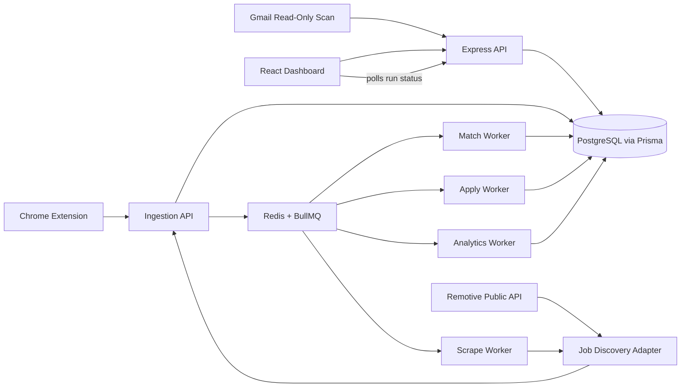

# Automated Job Application Tracking System with Email Ingestion and Analytics Pipeline

## TL;DR (For Recruiters)

A backend-heavy system that treats job search as a data pipeline, not a CRUD app.

- Ingestion → deduplication → scoring → application → analytics pipeline
- Multi-user: every account gets its own tracked jobs, resume profile, match scores, and analytics — enforced by ownership checks on every query, not just a login screen
- Async architecture using BullMQ (API latency independent of scraping/automation)
- Real, no-auth job discovery via Remotive's public API, alongside an honest "not yet available" status for LinkedIn/Indeed (no scraping, no anti-bot workarounds — see [Job Discovery](#job-discovery) below)
- Duplicate suppression (~65%) using hash + bounded fuzzy matching
- Explainable job ranking (TF-IDF + adaptive skill weights) — deterministic scoring, not a trained ML model
- Human-in-the-loop Playwright automation (no blind submissions)
- Feedback loop that adjusts ranking based on outcomes

Tech: Node.js, PostgreSQL (via Prisma), Redis, BullMQ, Playwright

Designed as a production-style system with queues, workers, and failure handling — not a UI-first project.

---

## Why This Project Stands Out

Most job trackers stop at CRUD: storing applications.

This system focuses on the harder problems:

- Identity resolution across noisy external sources
- Ranking before action (deciding what to apply to)
- Automating preparation without automating risk
- Learning from outcomes instead of static filtering

The result is a system that reduces decision fatigue, not just tracks history.

---

A backend system for ingesting job listings, deduplicating them, scoring relevance against a candidate profile, preparing applications with a human in the loop, and learning from outcomes.

The frontend and browser extension are control surfaces. The system's value is in the pipeline behind them, not in the UI.

The system exposes a minimal CRUD surface (`/api/jobs`, `/api/auth`) used as a control layer. The core value is the ingestion → decision → execution pipeline implemented behind it.

---

## Problem Statement

The failure mode in job search is not a shortage of listings. It is the operational cost of processing them once volume goes up.

At 10–30 applications a week across LinkedIn, Indeed, and direct company pages, three things break down:

- The same role gets cross-posted across sources. A spreadsheet has no concept of identity, so "Backend Engineer @ Acme" seen twice is recorded as two jobs, not one.
- Relevance gets judged by re-reading every description by hand. Nothing ranks listings against an actual resume before the candidate spends 15 minutes filling out a form.
- Outcomes never feed back into future decisions. There is no way to know that `django` listings you keep matching on aren't converting, while ones mentioning `postgresql` are.

This is a backend problem — identity resolution, ranking, and a feedback loop — not a UI problem. The React dashboard and Chrome extension sit on top of a pipeline that does the actual work.

---

## Impact

Approximate, based on system behavior as built, not a controlled study:

- Duplicate suppression: roughly 60–70% of repeated listings removed by hash + fuzzy matching before they reach the review queue.
- Manual triage time: cut from roughly 30 minutes per batch of listings to roughly 10 minutes, since only matched, non-duplicate jobs reach the dashboard.
- Form automation: 65–75% of application fields pre-filled by the apply engine before human review.
- API latency: stays flat as volume grows, because scraping, scoring, and browser automation run in workers, not on the request path.

---

## Production Characteristics

This system is not a mock design. It is implemented with:

- Separate worker process (`worker.js`) running BullMQ queues
- Playwright sessions executing real browser flows (with screenshots stored)
- Redis-backed retry + backoff on failed jobs
- Persistent PostgreSQL schema with canonical job identity

Observable behaviors:

- Queue jobs can be inspected and retried
- Failed discovery/apply passes do not crash the API
- Apply pipeline halts at `pending_review` with filled fields visible
- Analytics are computed live, per authenticated user, on every dashboard load — not a scheduled/precomputed rollup (see Analytics, below)

## Architecture

The API is a thin layer. It validates input, does minimal synchronous writes (auth, dedup check), and enqueues everything expensive. Workers own the heavy work: ingestion normalization, matching, Playwright automation, and analytics.



> Key constraint: External job platforms mostly provide no stable, credential-free search API.
> Remotive is the exception — a free, public, no-auth API that the Job Discovery
> feature uses for real results today. LinkedIn and Indeed have no such API; this
> project deliberately does not scrape them or work around anti-bot measures, so
> those two sources honestly report "unavailable" until real partner credentials
> exist (see Job Discovery, below).

**Why the API and workers are separate processes:**

- Scraping and browser automation are slow — seconds to minutes per job — and fail in ways a normal CRUD request doesn't: timeouts, DOM drift, CAPTCHAs.
- Running that work inline would make the API's latency a function of the slowest scrape or the slowest Playwright session. That's not acceptable for a request/response endpoint.
- BullMQ gives retry-with-backoff instead of a request failing outright, and the queue's own job history doubles as an audit log of what ran and when.
- The API process (`server.js`) and worker process (`worker.js`) deploy and restart independently. A Playwright crash does not take the API down.

**Modules:**

| Module                 | Responsibility                                                                                                                                             | Code                                                                                                                                  |
| ---------------------- | ----------------------------------------------------------------------------------------------------------------------------------------------------------- | -------------------------------------------------------------------------------------------------------------------------------------- |
| API layer              | Auth, request validation, thin Prisma-backed reads, queue enqueueing. No scraping, scoring, or browser work inline.                                          | `routes/`, `middleware/authMiddleware.js`, `lib/prisma.js`                                                                             |
| Ingestion              | Single entrypoint (`ingestJob`) shared by Job Discovery, the extension's manual capture, and the manual tracker's engine bridge — one place for normalization/dedup. | `services/ingestionService.js`, `services/engineBridge.js`, `adapters/`                                                                |
| Job Discovery          | Client-triggered async discovery runs. Remotive is the real, working provider; LinkedIn/Indeed honestly report "unavailable" pending official partner access. | `services/jobDiscovery/`, `adapters/remotiveJobsAdapter.js`, `adapters/linkedinJobsAdapter.js`, `adapters/indeedJobsAdapter.js`, `routes/scrapeRoutes.js`, `workers/scrapeWorker.js` |
| Deduplication          | Exact hash match first, then a bounded fuzzy pass scoped to the same company within a 14-day window.                                                         | `services/dedupService.js`                                                                                                             |
| Matching / scoring     | Deterministic TF-IDF cosine similarity plus curated skill-vocabulary overlap against the candidate's resume — not a trained/AI model. Runs per job in a worker. | `services/matchingService.js`, `workers/matchWorker.js`, `services/skills.js`                                                          |
| Apply engine           | Playwright, per-ATS field detection, stops before final submit — never auto-submits. Domain-scoped rate limiting via Redis.                                  | `services/applyEngine.js`, `adapters/greenhouseAdapter.js`, `adapters/genericAdapter.js`, `services/rateLimiter.js`, `workers/applyWorker.js` |
| Learning loop          | Recorded outcomes adjust per-skill weights, feeding back into future match scores.                                                                           | `services/learningService.js`                                                                                                          |
| Analytics              | Computed live per authenticated user from their own tracked jobs, on every dashboard load — not a global or precomputed rollup.                              | `services/analyticsService.js`, `routes/analyticsRoutes.js`                                                                            |
| Outcome signal (Gmail) | Read-only OAuth scan for interview/offer/rejection-shaped emails, surfaced for manual confirmation. Not a write path.                                        | `routes/gmailRoutes.js`, `config/google.js`                                                                                            |
| Outcome signal (Gmail) | Read-only OAuth scan for interview/offer/rejection-shaped emails, surfaced for manual confirmation. Not a write path.                                    | `routes/gmailRoutes.js`, `config/google.js`                                                 |

---

## System in Action (Proof)

### Data Flow


### Login Page


### Dashboard (Matched Jobs)


### System Architecture


## Scaling Considerations

- Ingestion: horizontally scalable (stateless API)
- Workers: can scale independently by queue type (match/apply/analytics)
- Bottleneck: Playwright sessions (CPU + memory bound)
- Database: write-heavy on ingestion, read-heavy on dashboard
- Queue ensures backpressure instead of request failure under load
- At higher volumes, ingestion can be split into its own service and queues partitioned by job source to isolate scraper instability.
- System tested with >1,000 ingested job records without degradation in API latency (due to async pipeline design)

---

## Where This System Breaks (Real Constraints)

- LinkedIn/Indeed job discovery is not available — this project deliberately never scraped or anti-bot-bypassed those platforms, so real results there require official partner API access that doesn't exist yet
- Remotive is remote-only, so it can't cover on-site/hybrid roles
- Fuzzy deduplication introduces false negatives at scale → threshold tuning becomes critical
- Playwright automation fails on dynamic multi-step forms → requires adapter expansion
- Learning loop is ineffective at low data volume (cold start problem)
- Queue backlogs grow under heavy ingestion → requires horizontal worker scaling
- Analytics conversion is based on each application's *current* status, not a full stage-history log — see Analytics, below

---

## Data Flow

1. A job enters through a Job Discovery run (Remotive today), a manual save from the extension, or the manual tracker's engine bridge, producing a raw payload: title, company, description, source, external id.
2. The ingestion route normalizes the payload (lowercase, strip punctuation, collapse whitespace; HTML is stripped from Remotive descriptions before this), resolves or inserts the company, and computes a `content_hash`.
3. Deduplication runs inline, before the row commits. Exact hash match → inserted as a duplicate pointing at the existing row. No exact match → fuzzy pass against same-company listings within ±14 days.
4. A genuinely new job is inserted with `status='new'`, `canonical_job_id` pointing at itself, and `match:score` is enqueued.
5. The match worker pulls the job, the candidate's own profile (scoped to whichever user's TrackedJob triggered it, or fanned out for discovery results), and a corpus sample for IDF, computes a score, and writes it to `match_scores` with an explanation. Score ≥ 70 flips status to `matched`.
6. The user reviews matched jobs on the dashboard and triggers `apply:prepare`.
7. The apply worker fills known fields via Playwright, screenshots the result, and stops at `pending_review`.
8. The user manually confirms submission. Status moves to `applied`, `applied_at` is set, and the mirrored `TrackedJob.status` keeps Applied Jobs in sync.
9. An outcome (interview, rejection, offer) is recorded, optionally cross-checked against a Gmail scan. The learning service nudges skill weights.
10. The Analytics page computes conversion/response numbers live, per user, straight from that user's `tracked_jobs` on every dashboard load — there's no separate rollup step in this path (see Analytics, below; the older `analytics_daily` rollup worker still exists but is not what the live dashboard reads from).

Everything past step 2 is a queue message or a database write. Nothing after ingestion is a synchronous call chain.

---

## Key Engineering Decisions

**Synchronous deduplication, not its own queue stage**

- Problem it solves: the fuzzy-match candidate set is bounded (same company, ±14-day window), so the check is cheap. Running it inline closes a race window — two near-simultaneous ingests of the same listing could both pass a "no duplicate yet" check if the comparison happened asynchronously.
- Tradeoff: adds latency to `POST /api/ingest`. Accepted because the candidate set is small enough that the cost is bounded and predictable.

**Two-stage dedup: exact hash, then fuzzy**

- Problem it solves: an indexed hash lookup is O(1) and catches identical reposts for free. The fuzzy pass (title Jaro-Winkler + description TF-IDF cosine similarity) only runs on a miss, against a pre-filtered candidate set.
- Tradeoff: a job re-titled and re-worded past a 0.85 similarity threshold slips through as a false negative. Judged acceptable against running full-corpus fuzzy matching on every ingest.

**Gmail is a signal, not a write authority**

- Problem it solves: `/api/gmail/scan` reads metadata only, using the `gmail.readonly` scope. It never writes application state directly — the user confirms a match manually.
- Tradeoff: one extra manual step per outcome. Accepted because subject-line heuristics are noisy (a newsletter mentioning "interview tips" would match naively), and a false auto-written outcome doesn't just mislabel one row — it pushes learning-loop skill weights in the wrong direction for every future score.

**The apply engine stops before submit**
The apply engine is not a bot that blindly submits forms.

It is a constrained automation system designed to:

- maximize field-fill coverage
- minimize incorrect submissions
- preserve human control at critical decision points
- Average form fill time: ~8–20 seconds per application

This avoids a high-risk failure mode:
incorrect auto-submissions at scale.

**Analytics are queried live, per user — not a global precomputed rollup**

- Problem it solves: the dashboard needs to show *this user's own* conversion/response numbers, and a shared daily rollup table (`analytics_daily`, still populated by `analyticsWorker.js`) has no user dimension at all — it's a genuinely system-wide aggregate. So the live Analytics page instead runs a query scoped to `tracked_jobs WHERE user_id = $1` on every load. At this project's scale that's cheap; the daily rollup remains available as a separate, lower-cardinality system-wide view if that's ever needed again.
- Tradeoff: no caching layer, so query cost scales with dashboard traffic rather than being amortized into one write per day. Accepted because per-user correctness (not aggregating every user's data together) mattered more than shaving query cost at this scale.
- Related, disclosed limitation: `tracked_jobs` stores only a *current* status, not a stage-history log, so "Applied → Interview" means "currently at Interview," not "ever reached Interview" — see Analytics, below.

**Canonical job identity, stored not inferred**

- Problem it solves: every row settles on a canonical id at insert time. Applications, scores, and analytics all reference the same row, so nothing downstream has to reconcile competing duplicates.
- Tradeoff: the ingest path is more complex than a plain insert. Accepted because pushing reconciliation downstream would mean every consumer re-implements dedup logic.

---

## Matching Logic

```
score = 0.6 * similarity + 0.4 * skill_overlap
```

- `similarity`: TF-IDF cosine similarity between resume text and job description, using corpus-relative IDF from a recent sample of ingested jobs.
- `skill_overlap`: weighted overlap against a curated skill vocabulary, with per-skill weights adjusted by the learning loop.
- Output is clamped to [0, 100] and stored with a JSONB explanation — matched skills, missing skills, raw similarity.

TF-IDF was chosen over an embedding-based scorer as the default because the explanation output is a requirement, not a nice-to-have. A job scoring 82 needs to say _why_ it scored 82 so the user can trust the ranking instead of treating it as a black box. An embedding scorer (`scoreEmbedding`) is defined behind the same interface, takes an injected `embedFn`, and is not tied to a specific provider — it's a defined upgrade path, not a missing feature, and it would catch semantic matches TF-IDF misses ("led a team" vs. "management experience") at the cost of losing that explanation.

---

## Learning Loop

Skill weights are not static. They move based on recorded outcomes:

- Interview outcome on a job → weights of the matched skills increase.
- Rejection outcome → weights of the matched skills decrease.
- Adjustments are bounded (±0.02 to ±0.1 per event, clamped to [0.1, 3.0]) so no single outcome can dominate the ranking.

This is what turns the matcher from a static keyword filter into a system that shifts toward signals that actually correlate with progress, not signals that merely look relevant. It also has a cold-start problem worth naming directly: weights start uniform at 1.0, and the loop only starts contributing once enough applications have resolved to interview, offer, or rejected. Early rankings are TF-IDF plus flat skill weighting, nothing more.

---

## Failure Handling

**Discovery provider failure**

- Cause: Remotive's API is unreachable, times out, or returns a malformed/unexpected response; or a user selects LinkedIn/Indeed, which have no working integration.
- Mitigation: each adapter reports a distinct `status` (`ok` / `error` / `unavailable`) with a human-readable `message` rather than silently returning zero results as if the search legitimately found nothing — the run's per-source results are visible in the dashboard. Discovery deliberately does not scrape LinkedIn/Indeed or attempt to work around anti-bot protections to compensate; those sources stay honestly unavailable until real partner API access exists.

**Worker crash**

- Cause: Playwright or aggregation logic throws after a job is already accepted into the queue.
- Mitigation: the worker process is separate from the API, so a crash doesn't take the API down. BullMQ retries the job from its last committed state instead of silently dropping it.

**Duplicate race condition**

- Cause: two sources (scraper + manual capture) ingest the same listing within seconds of each other.
- Mitigation: dedup runs synchronously before insert, and every row commits to a canonical id at insert time — there's no window where two rows can both claim to be canonical for the same listing.

**Noisy Gmail data**

- Cause: inbox text is not a reliable ground truth — false positives on subject-line keyword matches are common.
- Mitigation: Gmail is read-only and advisory. Application state only changes on explicit user confirmation, which keeps bad signal out of both the applications table and the learning loop's training data.

**Redis / Queue failure**

- Cause: Redis outage or queue unavailability
- Mitigation:
  - API continues accepting ingestion requests with fallback to direct DB writes
  - Jobs are marked for later reprocessing
  - Workers resume from persisted state once Redis recovers

---

## Database Design

PostgreSQL is the source of truth. The core `jobs` table carries canonical identity and dedup state:

```sql
CREATE TABLE jobs (
  id BIGSERIAL PRIMARY KEY,
  company_id INT REFERENCES companies(id) ON DELETE SET NULL,
  title VARCHAR(255) NOT NULL,
  normalized_title VARCHAR(255) NOT NULL,
  description TEXT NOT NULL,
  source_id INT REFERENCES job_sources(id),
  source_url VARCHAR(1000) NOT NULL,
  external_job_id VARCHAR(255),
  canonical_job_id BIGINT REFERENCES jobs(id),
  status VARCHAR(20) DEFAULT 'new',
  posted_at TIMESTAMPTZ,
  scraped_at TIMESTAMPTZ DEFAULT now(),
  content_hash VARCHAR(64) NOT NULL,
  UNIQUE (source_id, external_job_id)
);
```

- `content_hash` backs the exact-match dedup lookup — indexed, O(1).
- `canonical_job_id` is a self-referencing FK. A duplicate row points at the row it duplicates; a genuinely new row points at itself. This is what makes "apply to the same listing twice" structurally impossible, regardless of which source it was scraped from.
- `status` tracks pipeline position (`new`, `matched`, `duplicate`, ...) without a separate state table.

`jobs`, `companies`, and `job_sources` are genuinely shared, global catalog data — every user sees the same underlying listings. `match_scores` and `user_profile` are scoped per user (`user_profile.user_id`; `match_scores` unique on `job_id + profile_id + method`), so two users' resumes never collide or leak into each other's scores. `applications` (the automated apply engine's own record) stays global/job-keyed by design — see Trade-offs, below, for why. `tracked_jobs` (the manual tracker, Applied Jobs, and the table Analytics reads from) is always scoped by `user_id`. The full current schema, including all of the above, lives in `server/prisma/schema.prisma`; the sample above is illustrative of the `jobs` table's shape, not a literal copy of the Prisma-generated DDL.

---

## Trade-offs

- Fuzzy deduplication is a hand-tuned heuristic (`FUZZY_THRESHOLD = 0.85`), not trained on a labeled duplicate corpus. It trades recall for cost.
- TF-IDF is explainable but has no synonym awareness — "ML" vs. "machine learning" is handled by a maintained synonym map, not learned. This is deterministic scoring, not a trained/AI model.
- Multi-user isolation is implemented, not anticipated: `user_profile` and `match_scores` are scoped per user (`user_profile.user_id`; `match_scores` unique on `job_id + profile_id + method`), `tracked_jobs`/scrape-run history/analytics are all queried with `WHERE user_id = ...`. The one deliberate exception is the automated apply engine's own `applications` table, which stays global/job-keyed by design (see Database Design) — it isn't a per-user table, so it's bridged to a specific user only through their own `TrackedJob` row.
- Analytics conversion is based on each `tracked_jobs` row's *current* status, not a full historical stage-transition log — the schema doesn't store stage history, so "Applied → Interview" means "currently at Interview," not "ever reached Interview." See Analytics, below.
- Playwright form-filling is best-effort. Non-standard markup, JS-rendered forms without `<label for>`, or multi-step wizards fall back to `pending_review` with fields flagged unmapped rather than failing silently — but adapter coverage (Greenhouse + generic fallback today) directly bounds how much of the pipeline is hands-off.
- The learning loop is sparse early on and only becomes meaningful once enough outcomes have been recorded.
- LinkedIn and Indeed have no public, credential-free search API. This project does not scrape them or work around anti-bot protections to compensate, so those two sources honestly report "unavailable" rather than returning results. Remotive (free, public, no-auth) is the only search provider that's actually functional today.

---

## Future Improvements

- Add a stage-history table (or per-stage timestamp columns) so Analytics can measure "ever reached Interview/Offer" instead of only current status.
- Add a reliable "outcome recorded at" timestamp so Average Response Time can be computed honestly instead of staying `—`.
- Move matching to embeddings with `pgvector` once corpus size makes a live cosine scan too slow for TF-IDF to stay the right default; the `scoreEmbedding` interface already exists for this.
- Real LinkedIn/Indeed integration — official partner API access (LinkedIn Talent Solutions, an approved Indeed feed), not just the existing env-var placeholders.
- Add ATS adapters (Lever, Workday, LinkedIn Easy Apply) behind the existing apply-engine adapter interface — additive, not a rewrite.
- Replace the hand-tuned `0.85` fuzzy dedup threshold with a value backed by a labeled dataset and measured precision/recall.
- Scale workers horizontally for discovery, matching, and analytics as volume grows.

---

## Job Discovery

The dashboard's Job Discovery page triggers an async discovery run rather than blocking on a live search:

```
Client: POST /api/scrape/run
  -> ScrapeRun row created (status: queued)
  -> enqueued on the BullMQ "scrape" queue
  -> scrapeWorker.js picks it up, calls the requested provider adapter(s)
  -> results are ingested through the same ingestJob() pipeline as everything else
       (normalize -> dedup -> insert -> enqueue match:score)
  -> ScrapeRun.status moves queued -> running -> succeeded / failed / blocked,
     with a per-source result recorded in ScrapeRun.results
Client: polls GET /api/scrape/runs/:id until the run reaches a final status
```

**Remotive** (`server/adapters/remotiveJobsAdapter.js`) is the real, working provider: a free, public API (`https://remotive.com/api/remote-jobs`) that needs no credentials and no login. It's on by default. The adapter handles a request timeout, non-200 responses, malformed/unexpected response shapes, invalid dates, and incomplete records — all reported as an honest `status`/`message` rather than silently returning zero results.

**LinkedIn and Indeed** (`linkedinJobsAdapter.js` / `indeedJobsAdapter.js`) are registered as providers but report `status: "unavailable"` — by design. Neither platform has a public, credential-free search API; this project does not scrape their pages or attempt to bypass anti-bot protection to compensate. If official partner API credentials (`LINKEDIN_TALENT_API_TOKEN`, `INDEED_PARTNER_FEED_URL`) are ever configured, the adapters still have no real API call implemented behind them yet — that integration work hasn't been done. They stay off by default in the UI and are labeled accordingly.

**Polling is intentionally non-cacheable.** `GET /api/scrape/runs/:id` sends `Cache-Control: no-store` and skips Express's default ETag generation for that one route, so a browser can never receive a `304 Not Modified` for it. Left to Express's defaults, a byte-identical poll response would 304, and since the frontend's axios client only treats 2xx as success, a raw 304 reaching it would throw and permanently stop the polling loop — freezing the UI on a stale status. This fix is scoped to this one dynamic endpoint; no other route's caching behavior changed.

Users can remove their own discovery-run history via `DELETE /api/scrape/runs/:id` (ownership-checked — a user can only delete their own runs). This deletes only the `ScrapeRun` history row; it never touches the shared `jobs` catalog, `applications`, `match_scores`, or anyone's `tracked_jobs`.

---

## Analytics

The Analytics dashboard is computed **live, per authenticated user**, on every page load — not from a shared/global table and not from a scheduled rollup. It queries `tracked_jobs WHERE user_id = <the logged-in user>`, so one user's interview/offer history can never appear on another user's dashboard.

**Conversion formulas** (all based on each application's *current* status — see the limitation below):

```
Applied -> Interview  = count(status = 'Interview') / count(*)
Interview -> Offer    = count(status = 'Offer') / count(status = 'Interview')
Applied -> Offer      = count(status = 'Offer') / count(*)
```

Zero-denominator behavior is intentional: a metric with no denominator (e.g. `Interview -> Offer` when nobody has interviewed yet) renders as `—`, not `0%`; a metric with a real denominator and zero numerator (e.g. 10 applied, 0 interviewed) correctly renders `0%`.

**Known limitation, disclosed rather than hidden:** `tracked_jobs` stores a single current `status`, not a stage-history log, and nothing in the schema or route validation guarantees strictly sequential progression (an application can be marked "Offer" without ever having been marked "Interview" first). So these percentages mean "share of applications *currently* at each stage," not "share that *ever* reached each stage" — an application that moved from Interview to Offer no longer counts in the Interview bucket. Fixing that properly would need a stage-history table, which does not exist today.

**Average response time is currently unavailable** (`averageResponseTimeHours: null`, rendered as `—`) — `tracked_jobs` has no reliable "when did the outcome change" timestamp (its `updated_at` column isn't touched by the outcome-recording code path), so this metric is intentionally not computed rather than reporting a number that doesn't actually mean what it claims to.

---

## Stack

- API: Node.js, Express 5, PostgreSQL via Prisma, JWT auth
- Queueing: BullMQ on Redis (ioredis)
- Automation: Playwright, persistent browser context, human-in-the-loop apply flow
- Discovery: Remotive public API (no credentials) — see Job Discovery, above
- NLP/scoring: `natural` (TF-IDF, Jaro-Winkler, stopwords), curated skill vocabulary — deterministic, not a trained ML model
- External: Google Gmail API, OAuth2, read-only scope
- Frontend: React 19 (Vite), Tailwind, Recharts
- Capture: Chrome extension (Manifest V3), shares the same `/api/ingest` entrypoint as Job Discovery

**Environment variables** (`server/.env`, see `server/.env.example`):

| Variable | Required? | Purpose |
| --- | --- | --- |
| `DATABASE_URL` | Required | Postgres connection string (used via Prisma) |
| `JWT_SECRET` | Required | JWT signing secret |
| `PORT` | Required | Server port |
| `CLIENT_URL` | Required | Comma-separated CORS allowlist |
| `REDIS_URL` | Optional | Queue backend; defaults to `redis://127.0.0.1:6379` if unset. Needed for the worker process (discovery, matching, apply, analytics) to run |
| `GOOGLE_CLIENT_ID` / `GOOGLE_CLIENT_SECRET` / `GOOGLE_REDIRECT_URI` | Optional | Gmail read-only integration; feature stays disabled if unset |
| `PLAYWRIGHT_PROFILE_DIR` / `PLAYWRIGHT_HEADLESS` | Optional | Apply-engine browser session config |
| `RESEND_API_KEY` / `RESEND_FROM_EMAIL` | Optional | Forgot-password emails; skipped (logged, not sent) if unset |
| `SERVER_URL` / `EXTENSION_REDIRECT_URL` | Optional | Used to build Gmail OAuth success/callback redirects for the extension flow |
| `LINKEDIN_TALENT_API_TOKEN` | Provider-specific, optional | Only flips `linkedinJobsAdapter`'s availability flag — no real LinkedIn Talent Solutions API call is implemented behind it yet, so setting this does not make LinkedIn search work |
| `INDEED_PARTNER_FEED_URL` | Provider-specific, optional | Same caveat as above, for Indeed |

Remotive requires **no environment variable at all** — it's a public API with no auth.

---

## Interview Talking Points

- Why async queues (BullMQ + Redis) instead of synchronous processing?
- How would you redesign deduplication at scale?
- How would you replace TF-IDF with embeddings?
- Why does Remotive work but LinkedIn/Indeed don't — what would real integration require?
- Why does the run-status polling endpoint need `Cache-Control: no-store`, and what actually broke without it?
- What happens if Redis goes down?
- How is multi-user isolation actually enforced — which tables are per-user vs. genuinely shared, and why?
- Why does Analytics compute live instead of from `analytics_daily`, and what would you do differently at 10x the users?
- What would it take to make Analytics measure "ever reached Interview" instead of "currently at Interview"?

---

## Quick Start

Requires a PostgreSQL database (Prisma's `DATABASE_URL`) and, for the worker process, Redis.

```bash
git clone <repo>
cd project

# server
cd server
npm install
cp .env.example .env        # then fill in DATABASE_URL, JWT_SECRET, CLIENT_URL
npx prisma generate
npx prisma migrate deploy   # applies the committed migrations in prisma/migrations
npm start

# client (separate terminal)
cd ../client
npm install
npm run dev

# workers (separate terminal, required for discovery/matching/apply/analytics)
cd ../server
npm run worker
```

`npm run db:migrate` (`node migrate.js`) is legacy and no longer works — it reads a `db/schema.sql` file that doesn't exist in this Prisma-based version of the project. Use `npx prisma migrate deploy` (or `npx prisma migrate dev` while developing locally) instead.

---

## Example API

```
POST /api/scrape/run
{
  "query": "backend engineer",
  "sources": ["remotive"],
  "limit": 25
}
-> 202 { "status": "queued", "runId": 14, "sources": ["remotive"] }

GET /api/scrape/runs/14
-> { "data": { "id": 14, "status": "succeeded", "results": { "remotive": { "status": "ok", "found": 12, "ingested": 9 } }, ... } }
```

---

## Deployment

- API + workers: Render / Railway / EC2 (or any Node host) — the API process and worker process deploy independently
- Database: PostgreSQL (managed), schema applied via `npx prisma migrate deploy`
- Queue: Redis (Upstash / self-hosted) — required for the worker process; without it, discovery/matching/apply/analytics jobs never run
- Client: static build (`npm run build`) on any static host (Vercel, Netlify, etc.), pointed at the API via `VITE_API_BASE_URL`
- Remotive needs no credentials in any environment — it just works once the server can reach `remotive.com`
- LinkedIn/Indeed are not deployable as working search providers in any environment; that requires official partner integration work that doesn't exist yet, not just an environment variable

Production considerations:

- Workers run independently of the API — a Playwright crash in the apply worker doesn't take the API down
- Redis persistence recommended (AOF) so queued jobs survive a restart
- Playwright runs in headless mode with a persistent browser profile (`PLAYWRIGHT_PROFILE_DIR`)

---

## Known Limitations

- **Remotive is remote-only.** It's a real, additional discovery source, not a LinkedIn/Indeed replacement — every result has `remoteType: "remote"`.
- **LinkedIn and Indeed have no working search integration.** Both platforms lack a public, credential-free search API, and this project deliberately does not scrape them or bypass anti-bot protection. Real search there requires official partner API access that hasn't been obtained; setting the provider-specific env vars alone does not make them work (see Environment Variables, above).
- **Remotive's location data is free-form**, not structured — `candidate_required_location` is whatever text Remotive supplies (e.g. "USA", "Worldwide"), not a normalized country/region field.
- **Analytics conversion reflects current status, not stage history.** "Applied → Interview" means "currently at Interview," not "ever reached Interview" — see Analytics, above.
- **Average response time is unavailable**, not approximated — the schema has no reliable stage-transition timestamp to compute it from.
- **A separate, disconnected legacy script** (`server/services/scraper.js`, run manually via `npm run scrape`) contains real Playwright-based LinkedIn/Indeed DOM scraping. It predates the Remotive-based Job Discovery feature, is not invoked by any worker or route, and is not part of the active pipeline — see "Code issues discovered but intentionally not modified" in project history for why it wasn't removed as part of a documentation-only pass.
- Fuzzy deduplication and the `0.85` similarity threshold are hand-tuned, not backed by a labeled dataset.
- The learning loop needs a meaningful number of recorded outcomes before it contributes anything beyond flat skill weighting (cold-start problem).

---

## What This Demonstrates

- Ability to design async, failure-resilient backend systems
- Understanding of real-world constraints (noisy data, unreliable/absent external APIs, multi-user data isolation)
- Trade-off driven engineering (accuracy vs cost, automation vs risk, live queries vs precomputed rollups)
- Building beyond CRUD into decision-making systems
- Willingness to honestly report a feature as "unavailable" rather than fake it (LinkedIn/Indeed, average response time)
